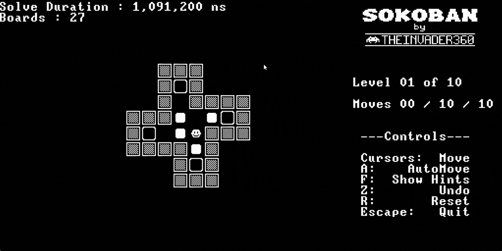

# Sokoban Go

Classic puzzle game written in golang overriding TheInvader360/sokoban-go. Thank you for sharing !



## Background

I am trying to do something fun.

## Usage

```bash
git clone https://github.com/julien2512/sokoban-go
```

Then:

```bash
cd sokoban-go
go run main.go
```

## Extra Features from original fork

1. undo feature
2. hints to solve sokoban puzzle
3. automove to solve sokoban puzzle
4. upgrade to pixel/v2
